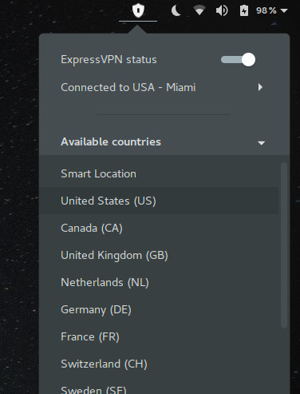

# Gnome shell extension for ExpressVPN

## Usage

When installing this extension, you will be able to manage ExpressVPN to connect to the different regions the service provide.

## Screenshot

## Limitations and considerations

* Right now, the extension assumes you have ExpressVPN with an activated license.

* The extension, at the moment depends on this packages being installed:

    * systemd (used to activate/deactivate the expressVPN service)
    * pkexec (used to run systemd commands as administrator)

* The regions shown in the panel menu, are missing sub-regions. For example, USA has 23 regions in total, but just the default will be printed for now.

## Contribution

Please feel free to contribute by sending pull requests or raising issues.

## License

Licensed under the GNU General Public License Version 2. See COPYING for details.

## Logo
By Fabián Alexis (https://github.com/fabianalexisinostroza/Antu) [CC BY-SA 3.0 (http://creativecommons.org/licenses/by-sa/3.0)], via Wikimedia Commons

## Authors

- faidoc (Alexandre Filgueira)
